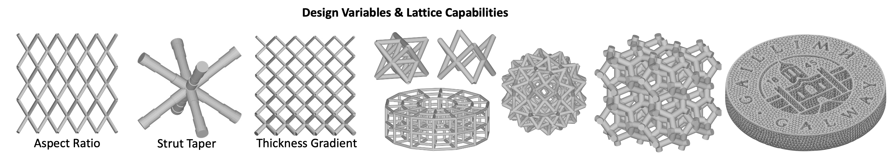

# LiDOT
Lattice Inverse Design &amp; Optimisation Tool

**Demonstrated in Paper :** - ref here - 

## Description

Scripts developed for optimising lattice structures to achieve a target compressive stress-strain curve. Lattices are generated in a beam-element format which can be written to an ABAQUS .INP file or exported to .3MF to be printed. The scripts can be used alone just to generate and export lattices and many lattice variations or in optimisation and FEA runs.

For full details on method and demonstrator of design optimisation scripts see paper linked.

**Example of optimisation process:**

   

## Getting Started

### Dependencies
* [GIBBON](https://www.gibboncode.org)
* Matlab Optimisation Toolbox / Global Optimisation Toolbox 
* ABAQUS 

### Installing
* Download and install the Matlab toolbox [GIBBON](https://www.gibboncode.org)
* Clone repository / download and extract files, ensure GIBBON is added to path as per the install instructions.
* Add subfolders to path
* Check file path for ABAQUS (set in ExplicitBeamCompression/StandardBeamCompression)

### Key Functions:

#### `Optimisation.m`.
* Script to run optimisation algorithm and visualise results
* Set varialbes, bounds, constraints, optimisation algorithm parameters etc...

#### `OptRun.m` (Objective function)
* Generates lattice based on input variables, runs FE with ABAQUS and returns objective function.
* Contains the definition of the target curve and calculation of objective function.
* The variable func_mode allows you to visualise lattices or check the target curve instead of running ABAQUS.
* For sample inputs, un-comment line 13 / use input variable below:
```
IN = [3 70 100 90 80 70];    % Variables Example
```

#### `GenerateLattice.m` / `GenerateLatticeExport.m`

* Function generates beam-element lattices based on an input structure of lattice parameters.
* Input an empty structure for defaults/demo (see example below). See function OptRun for details on all settings.
```
%% Generate example lattice to view output structure
GenerateLattice((struct))

%% 3D visualisation of lattice
ViewLattice(GenerateLattice((struct)))
```

   

#### `WireLattice.m`
* Generates lattices based on unit cells of a set size and grid (e.g BCC, FCC, or OCTET), or on the edges/dual of an input hex or tet mesh.
* Lattices based on the unit cells can also be generated based on an input hex mesh.
* Output is: N - nodes of lattices [x y z] co-ordinates, and S - strut array with nodes in each strut.

#### `LatticeExport_DEMO`
* Demo of exporting lattice to .3mf with write3mf
* Beam-element extension is supported mainly in software/slicers with a focus on metal AM, tested in 3DXpert, Netfabb, nTopology.

## Version History

* 1.0
    * Initial Release

## License

This project is licensed under the GNU Affero General Public License version 3 License - see the LICENSE.md file for details

## Acknowledgments

* [GIBBON](https://www.gibboncode.org)
* [write3mf](https://github.com/cvergari/write3mf)

